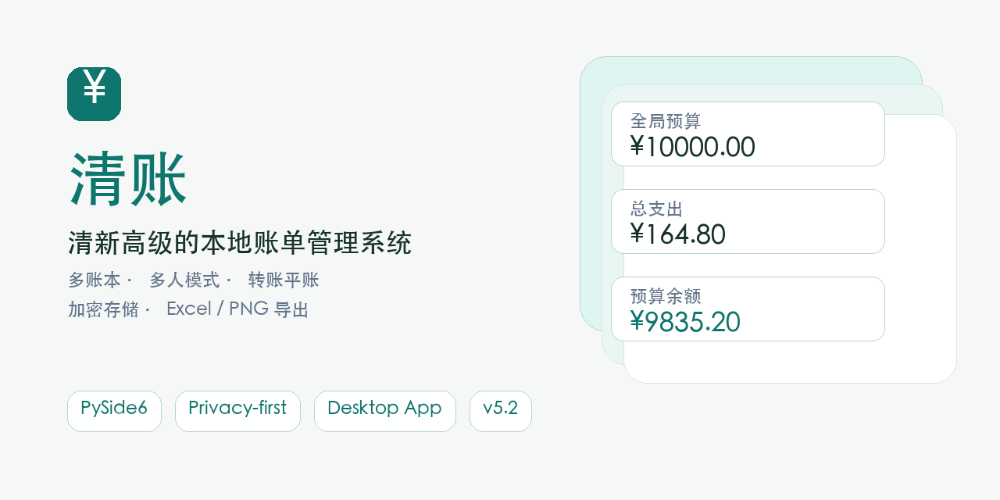
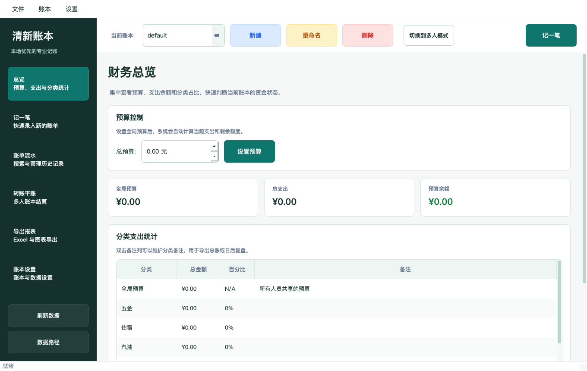
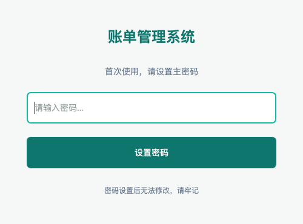
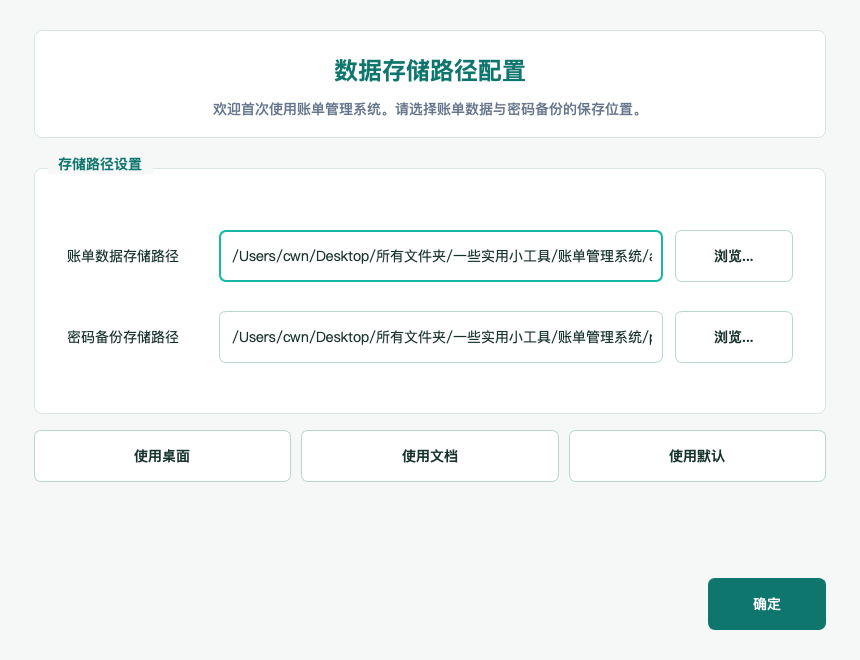

# 清账 · 账单管理系统



[](https://www.python.org/)
[](https://doc.qt.io/qtforpython-6/)
[](https://github.com/SC123667/qingxin-bill-manager/actions/workflows/ci.yml)
[](CHANGELOG.md)
[](LICENSE.txt)

清新高级的本地账单管理系统。支持专业侧边栏工作台、多账本、多人模式、主账单关联、转账平账、预算统计、加密存储、Excel 导出和 PNG 图表导出。

> 数据优先留在本机。仓库默认忽略本地账单数据、密码备份、加密文件和路径配置，避免误提交隐私信息。



## 为什么用它

- **多账本隔离**：家庭、差旅、项目、个人支出可以分开管理。
- **多人协作账单**：支持人员切换、主账单、手动转账和快速平账。
- **本地加密存储**：使用主密码保护账本数据。
- **导出友好**：支持 Excel 明细/总账模式，也能导出 PNG 图表。
- **专业桌面 UI**：侧边栏工作台、顶部账本状态栏、预算卡片、清晰表格和稳定的首次运行窗口。
- **读取已有数据**：首次打开可选择电脑上已有的数据目录，继续使用原主密码读取历史账单。

## 截图

| 登录 | 首次路径配置 |
| --- | --- |
|  |  |

## 安装包

- **macOS**：本地构建产物为 `release/QingZhang-macOS-v5.5.dmg`，打开后把 `清账.app` 拖到“应用程序”即可。
- **Windows**：仓库提供 GitHub Actions 打包流程，会生成 `QingZhang-v5.5-Setup.exe` 安装器，安装后会创建开始菜单和桌面快捷方式。

## 账单管理系统 v5.5 - 最近账单全量查看版

一个功能完整的多人账单管理工具，支持主账单关联、转账平账、账本切换、预算设置、账单录入、删除管理、分类备注、数据搜索和多种格式导出。采用模块化架构设计，代码结构清晰，维护性强。

## ✨ 主要特性

### 📚 多账本管理 (NEW!)
- **账本切换**: 支持创建多个独立账本，自由切换
- **账本隔离**: 每个账本的数据完全独立，互不影响
- **账本管理**: 可新建、删除、重命名账本（默认账本不可删除）
- **状态显示**: 清晰显示当前使用的账本

### 🔐 安全特性
- **主密码保护**: 首次使用时设置主密码，无法修改或找回
- **本地密码备份**: 密码设置后自动生成本地备份文件
- **数据加密存储**: 使用AES加密算法保护所有账本数据文件
- **账本级加密**: 每个账本独立加密存储

### 💰 账单管理
- **单人/多人模式**: 支持单人和多人账单管理模式自由切换 (NEW!)
- **多人员管理**: 在多人模式下可添加、删除人员，数据完全隔离 (NEW!)
- **主账单关联**: 可设置主账单人员，建立人员间的关联关系 (NEW!)
- **转账平账功能**: 支持手动转账和快速平账，实现账单间的资金流转 (NEW!)
- **多类别支持**: 13个预设分类 + 转账平账分类 + 无限自定义分类
- **自定义分类**: 可添加和删除个性化分类，满足不同需求
- **智能录入**: 快速添加账单记录，支持金额和备注信息，支持指定人员
- **删除管理**: 支持单个和批量删除账单功能
- **分类备注**: 为每个分类添加独立的总账备注，用于导出和说明
- **预算控制**: 全局预算管理，所有人员共享，实时监控支出状况
- **账本隔离**: 不同账本的数据完全独立

### 💸 转账平账管理 (全新功能!)
- **主账单设置**: 指定一个人员作为主账单，负责统一管理和支付
- **手动转账**: 在任意两个人员之间进行转账操作，自动记录收支
- **快速平账**: 一键将指定人员的所有支出转移到主账单，实现账单平衡
- **转账记录**: 完整记录所有转账操作，包括转出、收入和说明信息
- **余额监控**: 实时显示每个人员的支出、收入和账单余额状态
- **智能计算**: 自动计算实际支出，排除转账记录的重复计算

### 🔍 强大搜索
- **关键词搜索**: 支持按分类、金额、描述、日期等多维度搜索
- **实时结果**: 即时显示匹配的账单记录
- **账本范围**: 搜索仅在当前账本内进行

### 📈 数据可视化
- **统计总览**: 各类别支出统计和百分比分析，支持按人员显示
- **智能导出**: 支持明细模式和总账模式，真正区分导出内容
- **多人对比导出**: 多人导出使用对比表格格式（分类 | 人员A | 人员B | 总计），便于比较 (NEW!)
- **单人导出**: 单人导出保持传统格式（分类 | 金额 | 描述），简洁清晰
- **批量导出**: 在多人模式下支持批量导出多人数据 (NEW!)
- **时间控制**: 可选择是否包含时间信息
- **图表导出**: 生成精美的饼图和柱状图
- **Excel报表**: 完整的数据表格导出，自动识别人员信息
- **账本标识**: 导出文件自动标识所属账本和人员

### 🎨 现代化界面
- **清新浅色主题**: 采用低饱和青绿色、白色卡片和柔和边框，界面更轻盈高级
- **信息层级优化**: 总览页使用预算指标卡片，关键金额一眼可读
- **统一控件系统**: 按钮、表格、输入框、标签页和工具栏样式保持一致
- **响应式布局**: 适配不同屏幕尺寸
- **状态提示**: 窗口标题显示当前账本名称

## 🚀 快速开始

### 环境要求
- Python 3.8 或更高版本
- 支持的操作系统: Windows、macOS、Linux

### 安装依赖

#### 方法一: 使用自动安装脚本（推荐）
```bash
python3 install_dependencies.py
```

#### 方法二: 手动安装
```bash
pip install -r requirements.txt
```

#### 方法三: 使用清华镜像（国内用户推荐）
```bash
pip install -r requirements.txt -i https://pypi.tuna.tsinghua.edu.cn/simple/
```

### 运行程序

#### 方法一: 使用启动脚本（推荐）
```bash
python3 run.py
```

#### 方法二: 直接运行主程序
```bash
python3 main.py
```

## 📖 使用指南

### 首次使用
1. 运行程序后会提示设置主密码
2. 设置密码后会自动生成本地密码备份文件
3. 登录后会自动创建默认账本并进入主界面

### 多账本管理

#### 账本操作
- **创建账本**: 点击工具栏"新建账本"或菜单栏"账本 > 新建账本"
- **切换账本**: 使用工具栏下拉框或在"账本管理"页面双击账本名称
- **删除账本**: 在"账本管理"页面选中账本并点击删除（默认账本不可删除）
- **账本状态**: 当前使用的账本会在列表中高亮显示

#### 账本隔离
- 每个账本拥有独立的预算设置
- 每个账本的账单记录完全分离
- 搜索和统计仅在当前账本内进行
- 导出数据仅包含当前账本的内容

### 主要功能

#### 1. 总览页面
- 设置和查看全局预算（所有人员共享）
- 查看当前人员各类别支出统计
- 了解支出分布情况和剩余预算
- 编辑分类备注：双击备注列可为每个分类添加总账备注

#### 2. 添加账单
- 在当前账本中添加新的账单记录
- 选择支出分类（包括自定义分类）并输入金额和描述
- **多人模式**: 在多人模式下可选择为指定人员添加账单 (NEW!)
- **自定义分类管理**: 
  - 点击"添加分类"按钮创建个性化分类
  - 点击"删除分类"按钮移除不需要的自定义分类
- 查看当前账本最近添加的账单记录
- 支持在最近 20 条和全部历史记录之间切换
- 支持批量选择和删除最近账单

#### 3. 搜索功能
- 在当前账本中搜索历史记录
- 输入关键词进行搜索，支持模糊匹配
- 显示当前账本匹配结果列表
- 支持批量选择和删除搜索结果 (NEW!)

#### 4. 导出功能
- **导出设置**: 
  - 时间选项: 可选择是否包含时间信息
  - 导出模式: 明细模式（显示所有账单详情）或总账模式（显示各分类汇总金额和分类备注）
  - **多人导出**: 支持导出当前人员、指定人员或所有人员的数据 (NEW!)
- **Excel导出**: 导出账本数据表格，自动包含人员信息
- **PNG导出**: 导出可视化图表，包含饼图和柱状图

#### 5. 多人模式管理 (NEW!)
- **模式切换**: 工具栏中点击"切换到多人模式"按钮启用多人管理
  - **流畅动画**: 模式切换时显示加载动画，提升用户体验 (NEW!)
  - **UI自适应**: 单人模式下人员管理控件自动隐藏，多人模式下自动显示 (NEW!)
  - **确认对话框**: 切换前显示确认提示，避免误操作
- **人员管理**: 
  - 添加人员: 点击"添加人员"按钮添加新的账单管理人员
  - 删除人员: 点击"删除人员"按钮移除不需要的人员（需确保无账单数据）
  - 人员切换: 使用人员下拉框快速切换当前管理的人员
- **数据隔离**: 每个人员的账单数据完全独立，共享全局预算
- **界面状态**: 窗口标题和状态栏会显示当前选中的人员信息

#### 6. 账本管理
- 查看所有账本列表和状态
- 创建新账本和删除不需要的账本
- 快速切换不同账本

## 📁 文件结构

```
账单管理系统/
├── main.py                 # 主程序文件
├── run.py                  # 智能启动脚本
├── requirements.txt        # 依赖包列表
├── install_dependencies.py # 依赖安装脚本
├── README.md              # 项目说明文档
├── CLAUDE.md              # 项目详细文档
├── core/                  # 核心业务模块
│   ├── __init__.py        # 模块初始化
│   ├── bill_manager.py    # 数据管理核心
│   └── export_manager.py  # 导出功能模块
├── ui/                    # 用户界面模块
│   ├── __init__.py        # UI模块初始化
│   ├── login_dialog.py    # 登录对话框
│   └── main_window.py     # 主窗口界面
├── accounts_data/         # 账本数据目录
│   ├── default.encrypted  # 默认账本数据文件
│   ├── work.encrypted     # 工作账本数据文件（示例）
│   └── personal.encrypted # 个人账本数据文件（示例）
├── password_backups/      # 密码备份目录
│   └── password_backup_*.txt # 密码备份文件（首次设置时生成）
└── master_password.hash   # 主密码哈希文件
```

## 🔧 技术栈

- **GUI框架**: PySide6
- **数据处理**: pandas
- **图表生成**: matplotlib
- **加密算法**: cryptography (Fernet)
- **Excel操作**: openpyxl
- **多账本架构**: 独立文件加密存储

## 💡 使用场景

### 个人用户
- **生活账本**: 记录日常生活开支
- **旅行账本**: 独立记录旅行消费
- **项目账本**: 记录特定项目的支出

### 家庭用户
- **家庭总账**: 记录家庭日常开支
- **孩子教育**: 独立记录教育相关费用
- **房屋维护**: 记录房屋装修和维护费用

### 小微企业
- **办公费用**: 记录日常办公开支
- **差旅报销**: 独立管理差旅费用
- **项目预算**: 按项目分别管理预算

## ⚠️ 重要提醒

1. **密码安全**: 主密码一旦设置无法修改，请务必牢记
2. **数据备份**: 建议定期备份整个 `accounts_data` 目录
3. **隐私保护**: 程序不会向外部发送任何数据
4. **运行环境**: 建议在虚拟环境中运行，避免依赖冲突
5. **账本管理**: 删除账本会永久删除所有相关数据，请谨慎操作

## 🐛 故障排除

### 常见问题

**Q: 忘记主密码怎么办？**
A: 系统设计为无密码找回功能，请查看程序目录中的密码备份文件。

**Q: 程序启动失败？**
A: 请确保已正确安装所有依赖包，可运行 `install_dependencies.py` 重新安装。

**Q: 无法创建新账本？**
A: 检查程序目录是否有写入权限，确保 `accounts_data` 目录可以创建。

**Q: 账本切换失败？**
A: 可能是文件损坏或密码错误，尝试重启程序重新登录。

**Q: 图表导出失败？**
A: 可能是字体问题，程序会自动处理中文显示，如仍有问题请检查系统字体。

**Q: Excel导出无法打开？**
A: 确保系统已安装Excel或WPS等表格软件，文件格式为标准xlsx。

### 依赖安装问题

如果自动安装脚本失败，可以尝试：

1. 更新pip: `pip install --upgrade pip`
2. 使用国内镜像源安装依赖
3. 在虚拟环境中安装: `python -m venv venv && source venv/bin/activate`

## 🆕 版本更新

### v5.5 最近账单全量查看版 (2026-05-03)
- ✅ **最近账单显示全部**：记一笔页面新增“显示全部 / 显示最近20条”切换
- ✅ **全量批量操作**：全部记录视图同样支持全选、清除选择和批量删除
- ✅ **重复账单删除更准**：最近账单行保存原始账单索引，金额、描述、日期相同也能定位正确记录

### v5.4 既有数据读取增强版 (2026-04-30)
- ✅ **首次读取旧数据**：首次打开新增“读取已有数据目录”入口
- ✅ **目录智能识别**：支持选择旧程序目录、`accounts_data` 数据目录或包含 `path_config.json` 的目录
- ✅ **安全校验**：必须识别到原主密码文件才会当作可读取数据，避免不可解密数据被误处理
- ✅ **旧版兼容**：旧版根目录 `master_password.hash` 会自动迁移到当前数据目录结构

### v5.3 专业工作台界面版 (2026-04-28)
- ✅ **主界面架构升级**：从传统标签页升级为左侧导航 + 顶部账本状态栏 + 主工作区，更接近专业记账软件
- ✅ **六大页面重排**：总览、记一笔、账单流水、转账平账、导出报表、账本设置全部改为结构化工作台布局
- ✅ **表格列宽优化**：账单、搜索、统计、转账和账本表格改为关键列固定、描述列自适应，减少横向挤压
- ✅ **首次运行弹窗再修复**：路径配置窗口改为更宽的网格布局，长路径输入框、浏览按钮和确认按钮不再重叠
- ✅ **GitHub 截图更新**：README 使用的主界面、登录和路径配置截图已同步为新版 UI
- ✅ **安装器构建配置**：新增 macOS DMG 与 Windows NSIS 安装器构建流程

### v5.2 界面与性能优化版 (2026-04-28)
- ✅ **表格刷新优化**：总览、最近账单、搜索结果、账本列表、人员余额和转账记录在批量更新时暂停重绘，减少界面卡顿
- ✅ **启动性能优化**：延迟加载 matplotlib，仅在导出 PNG 图表时加载，降低日常启动负担
- ✅ **账本管理交互修复**：账本管理页双击账本可直接切换，操作提示同步更新
- ✅ **分类管理稳定性修复**：添加/删除分类后使用正确刷新入口，避免调用不存在方法导致崩溃
- ✅ **自定义分类删除校验修复**：删除自定义分类时正确检查所有人员下是否仍有账单，并清理各人员空分类
- ✅ **批量删除性能优化**：批量删除账单时合并为一次保存，避免逐条删除反复加密写盘
- ✅ **导出样式优化**：PNG 图表改为清新浅色风格，Excel 总账高亮逻辑更准确
- ✅ **首次运行窗口修复**：路径配置和登录对话框改为更稳定的弹性尺寸与间距，避免标题、输入框和按钮重叠

### v5.1 清新界面优化版 (2026-04-28)
- ✅ **全局主题重构**：从旧深色主题升级为清新浅色高级风格，统一窗口、表格、标签页、菜单和对话框样式
- ✅ **总览页层级优化**：预算、支出、余额改为指标卡片展示，降低信息拥挤感
- ✅ **按钮语义统一**：新增主要、危险、成功、提示、警告等统一按钮变体，移除分散内联样式
- ✅ **表格体验优化**：统一表头、行高、选中态和隔行底色，提升账单数据可读性
- ✅ **登录和路径设置优化**：对话框跟随新主题，减少装饰性符号，让入口更干净专业

### v4.2 UI模式切换优化版 (2025-07-04)
- ✅ **多人导出格式优化**：多人导出使用对比表格格式（分类 | 人员A | 人员B | 总计），便于比较不同人员支出
- ✅ **UI模式切换增强**：添加流畅的加载动画，提升模式切换的用户体验
- ✅ **自适应界面**：单人模式下人员管理控件自动隐藏，多人模式下自动显示
- ✅ **交互优化**：修复模式切换时弹出搜索提示的问题，确保操作流畅
- ✅ **强制UI刷新**：添加UI强制刷新机制，确保界面变化立即生效
- ✅ **确认机制**：模式切换前显示确认对话框，避免误操作
- ✅ **代码清理**：移除测试文件和临时数据，保持项目整洁

### v4.1 全局预算优化版 (2025-07-04)
- ✅ **全局预算系统**：优化预算逻辑，无论单人或多人模式，总预算全局共享
- ✅ **数据结构优化**：从per-person预算改为global预算，简化逻辑
- ✅ **UI界面更新**：预算显示改为"全局预算"，所有人员共享同一预算
- ✅ **导出功能优化**：导出文件中预算显示为全局预算，支持所有人员数据
- ✅ **数据兼容性**：自动从旧格式per-person预算迁移到新的全局预算
- ✅ **逻辑简化**：统一预算管理，避免多人模式下的预算复杂性

### v4.0 多人模式版 (2025-07-03)
- ✅ 新增多人账单管理模式：支持单人/多人模式自由切换
- ✅ 人员管理功能：添加、删除、切换人员，数据完全隔离
- ✅ 多人导出功能：支持导出当前人员、指定人员或所有人员数据
- ✅ 智能界面适配：根据模式自动显示/隐藏相关控件
- ✅ 数据兼容性：完美兼容旧版本单人模式数据
- ✅ 人员数据隔离：每个人员独立的预算、账单和统计
- ✅ 窗口标题优化：显示当前账本和人员信息
- ✅ 导出文件命名：自动包含人员信息的智能命名

### v3.3 自定义分类增强版 (2025-07-03)
- ✅ 新增自定义分类功能：支持添加和删除个性化账单分类
- ✅ 优化界面显示：增加分类列宽度，解决长分类名显示不全问题
- ✅ 分类管理界面：在添加账单页面集成分类管理按钮
- ✅ 数据兼容性：支持新旧数据格式自动转换
- ✅ 移除备份文件：清理项目结构，确保使用维护后的代码
- ✅ 表格优化：调整所有表格列宽以更好显示内容

### v3.2 路径优化版 (2025-07-03)
- ✅ 优化密码备份文件路径：统一保存在password_backups目录
- ✅ 改进数据读取逻辑：自动读取程序同目录下accounts_data中的历史数据
- ✅ 完善模块化架构：基于项目根目录的绝对路径配置
- ✅ 增强数据兼容性：确保历史账单数据完整迁移
- ✅ 目录结构优化：密码备份文件统一管理

### v3.1 分类备注增强版 (2025-07-03)
- ✅ 新增分类备注功能：每个分类可独立设置总账备注
- ✅ 总览界面优化：支出统计表格新增备注列，双击可编辑
- ✅ 总账导出优化：使用分类备注而非账单备注
- ✅ 自适应列宽改进：更好地处理中文字符显示
- ✅ 数据兼容性：支持旧数据格式自动升级

### v3.0 删除功能增强版 (2025-07-03)
- ✅ 新增删除单个账单功能
- ✅ 新增批量删除账单功能
- ✅ 搜索结果支持批量选择删除
- ✅ 最近账单支持批量选择删除
- ✅ 修复导出功能：明细模式和总账模式真正区分内容
- ✅ 优化项目结构，清理无用文件
- ✅ 增强用户体验，添加确认对话框

### v2.0 多账本版本 (2025-07-01)
- ✅ 新增多账本管理功能
- ✅ 支持账本创建、删除、切换
- ✅ 独立的账本数据加密存储
- ✅ 优化用户界面，新增账本管理页面
- ✅ 修复导出功能时间信息控制问题
- ✅ 完善账本状态显示和操作提示

### v1.1 导出功能增强版 (2025-07-01)
- ✅ 导出设置优化，新增时间选项控制
- ✅ 支持明细模式和总账模式选择
- ✅ 智能文件命名和图表标题优化

### v1.0 基础版本 (2025-06-30)
- ✅ 完整的账单管理功能
- ✅ 密码保护和数据加密
- ✅ 现代化UI界面设计
- ✅ 搜索和导出功能

## 📧 联系方式

如有问题或建议，请通过以下方式联系：
- 邮箱: 1844100669@qq.com

## 📄 许可证

本项目仅供个人学习和使用，禁止商业用途。

---

💡 **提示**: 推荐使用 `python3 run.py` 启动程序，会自动检测和安装依赖。多账本功能让您可以轻松管理不同类型的支出，每个账本完全独立，数据安全可靠。
